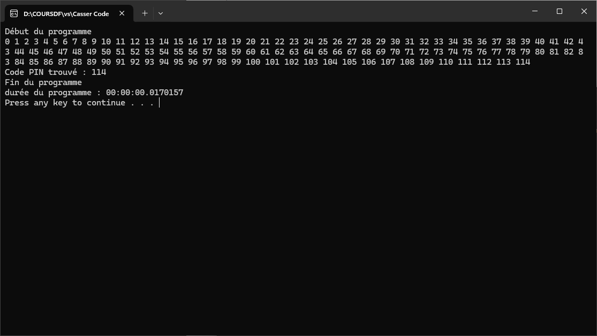
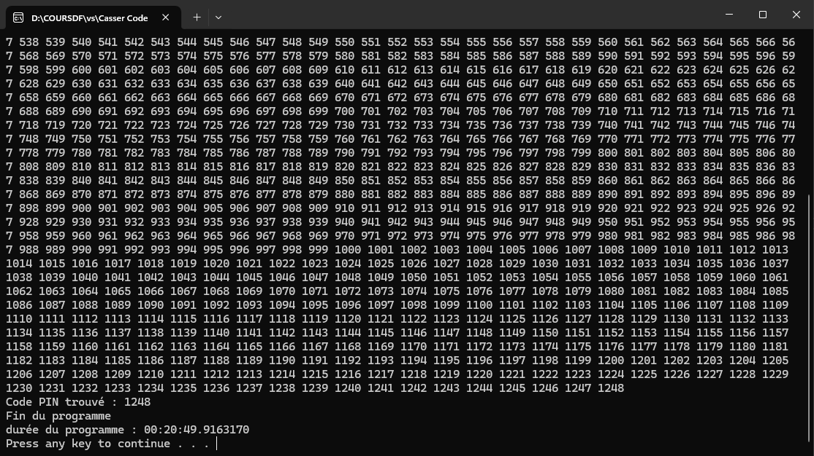

# 1. Lancez le programme
### a. Quelle est la durée de ce programme en secondes ?
**Sa durée est de 0.0163120 secondes.**

### b. En millisecondes (ms) ?
**Cela donne 16.3120 ms.**

# 2. Génération d'un code PIN à 4 chiffres aléatoire et application de la brute force

 

### Quelle est la durée du programme en secondes ? 
**Sa durée est de 0.0170157 secondes.**

# 3. Ajout d'une temporisation dans la boucle while

### a. Relancez le programme. Quelle est sa durée ?  
**Le programme prend maintenant environ 5.6181982 secondes à s'exécuter.**

### b. Mettez maintenant une temporisation de _1 seconde_. Quel est l'effet sur l'attaquant ? 
**L'effet sur l'attaquant est que ça lui prendra beaucoup plus de temps à trouver le code que s'il n'y avait pas un minimum de temps d'attente. Suivant la taille du code et les caractères présents cela prendra plus ou moins de temps à le décoder par brute force.**

