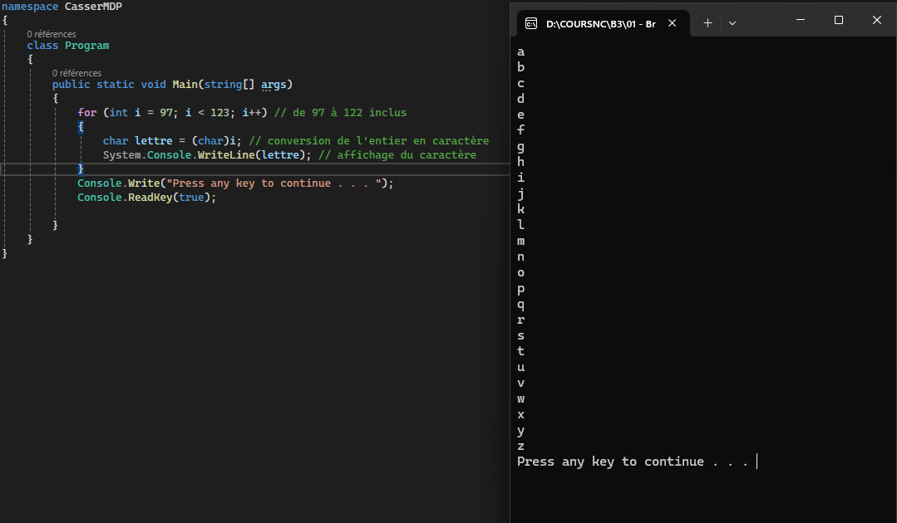
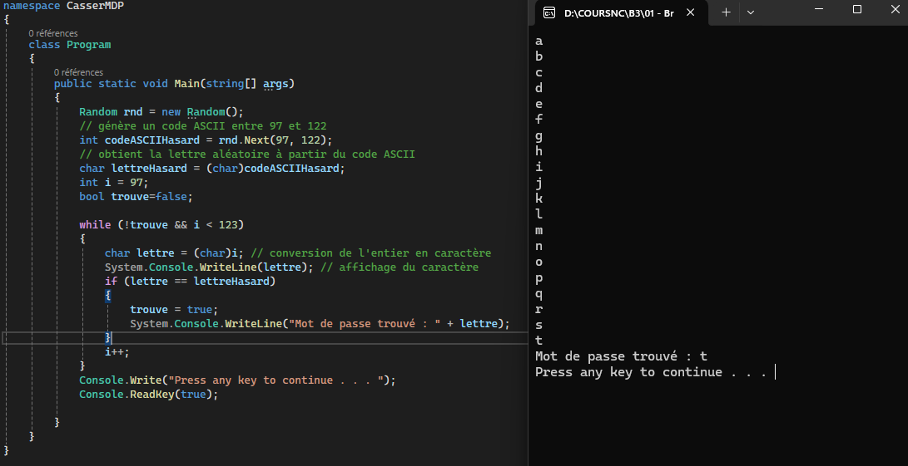
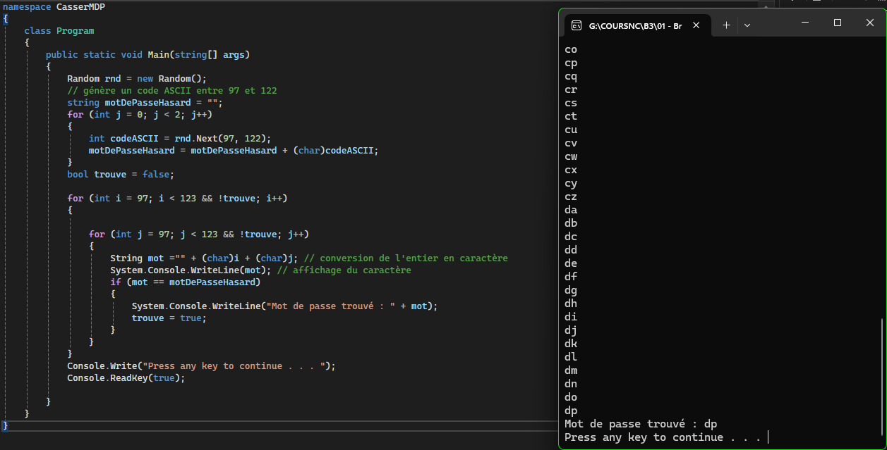
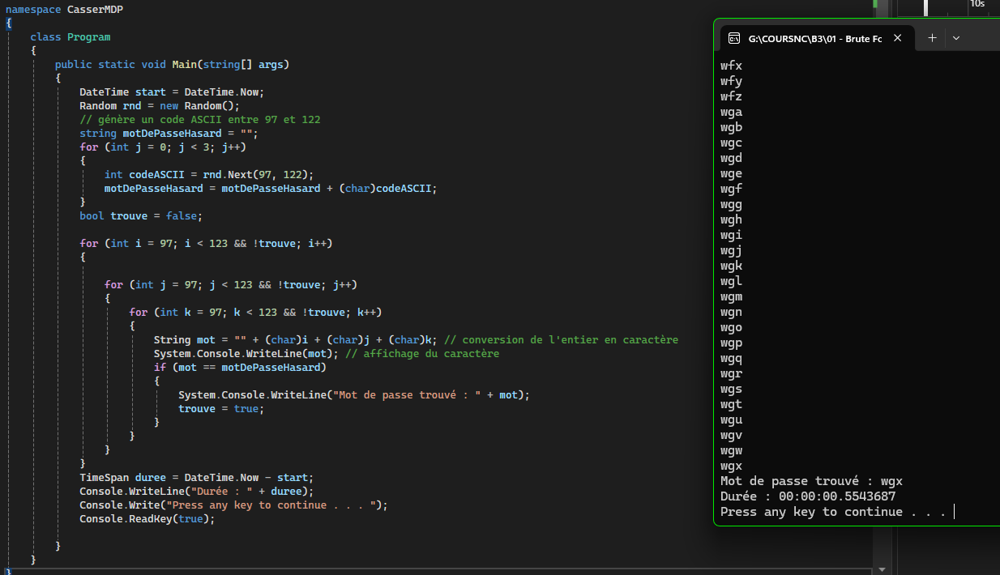

# 1. Premier test du premier programme

### a. A quoi correspond le caratère ASCII 97 ?

**Le caractère ASCII 97 correspond à la lettre 'a'**

### b. Qu'affiche le programme ?

**Le programme transforme le caractère ASCII 97 en caractère de type _char_ puis affiche le caractère càd : a**

### c. Test d'un deuxième programme. Qu'affiche-t-il ?

**Le programme affiche maintenant les 4 premières lettres de l'alphabet.**

# 2. Afficher toutes les lettres minuscules

### En vous inspirant du code précédent, affichez toutes les lettres minuscules de l’alphabet (de a à z) grâce à une boucle for.

# 3. Générer un mot de passe d'une lettre et la retrouver

# 4. Idem que précédemment mais avec 2 lettres

# 5. Bonus
### Faire la même chose avec un mot de passe de trois lettres et afficher le temps que cela a pris.

